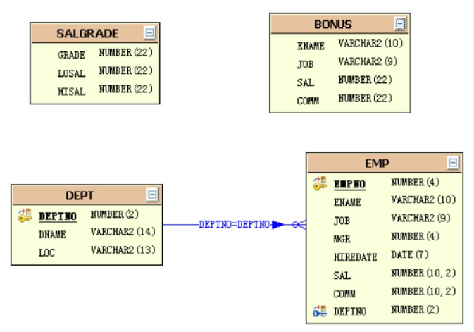

# Oracle学习

[Oracle学习01——基本概念与安装](blog/01.md)

[Oracle学习02——基本查询](blog/02.md)

[Oracle学习03——条件查询和排序](blog/03.md)


------


# Oracle学习01——基本概念与安装

## 一、Oracle概念

ORACLE数据库系统是美国ORACLE公司（甲骨文）提供的以分布式数据库为核心的一组软件产品，

是目前最流行的客户/服务器(CLIENT/SERVER)或B/S体系结构的数据库之一。比如SilverStream

就是基于数据库的一种中间件。ORACLE数据库是目前世界上使用最为广泛的数据库管理系统，

作为一个通用的数据库系统，它具有完整的数据管理功能；作为一个关系数据库，它是一个完

备关系的产品；作为分布式数据库它实现了分布式处理功能。但它的所有知识，只要在一种机型

上学习了ORACLE知识，便能在各种类型的机器上使用它。


---

## 二、Oracle安装

[如何在windows系统上安装Oracle数据库(10g)](https://jingyan.baidu.com/article/64d05a02716104de54f73b5b.html)

[Windows下Oracle安装图解----oracle-win-64-11g 详细安装步骤](https://www.cnblogs.com/liuhongfeng/p/5267549.html)

[Linux下安装Oracle 11g详细过程](http://www.linuxidc.com/Linux/2015-02/113222.htm)


----

## 三、Sqlplus安装

SQL*Plus是一个用于与Oracle Database交互和执行查询的工具，我们要安装的是命令行工具。

### 3.1 下载地址

[http://www.oracle.com/technetwork/topics/winx64soft-089540.html](http://www.oracle.com/technetwork/topics/winx64soft-089540.html) 

下载下面两个文件 或者其他版本

```
instantclient-basic-windows.x64-12.2.0.1.0.zip
instantclient-sqlplus-windows.x64-12.2.0.1.0.zip
```

### 3.2 安装命令行工具

把下载的两个文件解压到一起。得到一个文件夹 **instantclient_12_2**

把这个 文件夹的地址配置到环境变量 **PATH** 中。

例如：


其他可配置的环境变量

```
NLS_LANG=AMERICAN_AMERICA.UTF8
```

### 3.3 测试连接数据库

如果是本地的数据库(也可以添加ip地址)

```sql
sqlplus 用户名/密码
```

如果是远程的数据库

```sql
sqlplus 用户名/密码@数据库主机Ip
```

```sql
sqlplus username/password  
#如：普通用户登录  
sqlplus scott/tiger

sqlplus username/password@net_service_name 
#如: 
sqlplus scott/tiger@orcl

sqlplus scott/tiger@192.168.135.131/orcl

sqlplus  username/password as sysdba 
#如：
sqlplus sys/admin as sysdba
sqlplus username/password@//host:port/sid 
```

---

## 四、Oracle数据库体系结构


### 4.1 Oracle数据库
 Oracle数据库：位于硬盘上实际存放数据的文件，这些文件组织在一起，成为一个逻辑整体，
 
 即为Oracle数据库。因此在Oracle看来，“数据库”是指硬盘上文件的逻辑集合，必须要与
 
 内存里实例合作，才能对外提供数据管理服务。
 
 ### 4.2 Oracle实例
 
 Oracle实例：位于物理内存里的数据结构。它又一个共享的内存池和多个后台进程组成，共享
 
 的内存池可以被所有进程访问。用户如果要存取数据库（也就是硬盘上的文件）里的数据，必须
 
 通过实例才能实现，不能直接读取硬盘上的文件。
 
 ### 4.3 Oracle数据库和Oracle实例区别
 
 实例可以操作数据库；在任何时刻，一个实例只能与一个数据库关联；大多数情况下，一个数据库
 
 上只有一个实例对其进行操作。
 
 ### 4.4 数据文件（ dbf )

 数据文件（ dbf ) : 数据文件是数据库的物理存储单位。数据库的数据是存储在表空间中的，
 
 真正是在某一个或者多个数据文件。而一个表空间可以由一个或多个数据文件组成，一个数据
 
 文件只能属于一个表空间。一旦数据文件被加入到某个表空间后．就不能删除这个文件，如果要
 
 删除某个数据文件．只能删除其所属于的表空间才行.
 
 ### 4.5 表空间
 
 
 
 
  
 
 
 表空间是 Oracle 对物理数据库上相关数据文件（ORA或者DBF文件）的逻辑映射。一个数据库在
 
 逻辑上被划分成一到若干个表空间，每个表空间包含了在逻辑上相关联的一组结构。每个效据库
 
 至少有一个表控制（称之为system表空间），每个表空间由同一磁盘上的一个或多个文件组成，
 
 这些文件叫数据文件（ datafile ）。一个数据文件只能属于一个表空间。
 
 ### 4.6 用户
 
 用户是在实例下建立的。不同实例中可以建相同名字的用户。
 
 表的教据，是有用户放入某一个表空间的．而这个表空间会随机把这些表教据放到一个或者多个数据文件中。
 
 由于oracle的数据库不是普通的概念。 oracle 是有用户和表空间对数据进行管理和存放的。但是表不是有
 
 表空间去查询的．而是由用户去查的．因为不同用户，可以在同一个表空间建立一个名字的表，这里区分就是
 
 用户
 
  
  
  
  ### 4.7 scott用户和hr用户
  
  Oracle为了让学习者更好的进行学习，在安装成功后，也创建了初始的用户，其中scott与hr就是初始的普通
  
  用户。这些用户下面都默认存在了表结构。
  
  **scott用户下的表**
  

    
